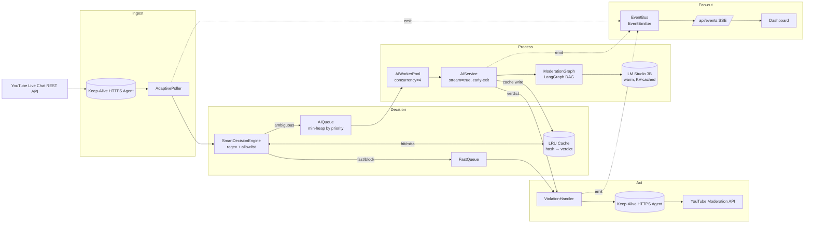

# YTChatGuard — System Design (LLD + Optimization Playbook)

> A real-time YouTube live-chat moderation system. This document is the single source
> of truth for **architecture, algorithms, optimizations, latency budgets, trade-offs,
> failure modes**, and an FAQ you can use to defend the design end-to-end.

---

## Table of contents

1. [Problem statement](#1-problem-statement)
2. [Constraints & non-goals](#2-constraints--non-goals)
3. [High-level architecture](#3-high-level-architecture)
4. [Component LLD](#4-component-lld)
5. [Algorithms & data structures](#5-algorithms--data-structures)
6. [Concurrency & backpressure](#6-concurrency--backpressure)
7. [Latency budget — before vs after](#7-latency-budget--before-vs-after)
8. [Why each optimization works](#8-why-each-optimization-works)
9. [Reliability, failure modes & recovery](#9-reliability-failure-modes--recovery)
10. [Observability](#10-observability)
11. [Security model](#11-security-model)
12. [Scaling story](#12-scaling-story)
13. [Trade-offs & alternatives considered](#13-trade-offs--alternatives-considered)
14. [Interview-style FAQ](#14-interview-style-faq)

---

## 1. Problem statement

Moderate a YouTube creator's live-chat stream in near real time:

- **Ingest** every chat message as it arrives.
- **Classify** each message: allow / warn / timeout / ban.
- **Act** on YouTube via the official Moderation API.
- **Surface** activity to a creator-facing dashboard.

End-to-end SLO: **violation acted on within ~1 s** of being posted (p50), **< 2 s** at p99.

---

## 2. Constraints & non-goals

### Hard constraints

- **YouTube Live Chat API is REST-only.** No webhook, no SSE, no WebSocket. The only push-style hint is the `pollingIntervalMillis` field in each list response.
- **YouTube Data API quota**: 10,000 units/day per project; `liveChatMessages.list` costs 5 units/call.
- **Single-creator deployment** runs on a laptop / small VM (Node.js + optional local LLM via LM Studio).
- **Local LLM is single-GPU**: realistic concurrency 2–4 in-flight requests.

### Non-goals

- Multi-tenant SaaS scale (different design — see §12).
- Bypassing YouTube ToS via reverse-engineered InnerTube endpoints (`pytchat`-style).
- Perfect classifier accuracy; we trade tail-accuracy for latency at the gates.

---

## 3. High-level architecture



### Why this shape

- **Pull on the inbound leg** because YouTube forces it.
- **Push on every leg we control** (LLM streaming, internal EventBus, SSE to UI).
- **Decision-first, AI-last** so cheap CPU work filters out 80–95 % of traffic before anything expensive runs.

---

## 4. Component LLD

### 4.1 AdaptivePoller

```
state:
  liveChatId: string
  nextPageToken: string | null
  inFlight: bool = false

tick():
  if inFlight: return
  inFlight = true
  res = await yt.liveChatMessages.list({ liveChatId, pageToken: nextPageToken })
  nextPageToken = res.nextPageToken
  emit('messages', res.items)
  delay = clamp(res.pollingIntervalMillis, 500, 3000)
  inFlight = false
  setTimeout(tick, delay)
```

- Replaces fixed `setInterval(2500)` with **server-driven cadence**.
- `setTimeout` chain prevents callback stacking when a request runs long.
- Single shared `https.Agent({ keepAlive: true })` reused across all calls.

### 4.2 SmartDecisionEngine

Decision tree, ordered by cost (cheapest first):

| Step | Cost | Outcome |
|---|---|---|
| 1. Owner / mod / whitelisted user | O(1) Set lookup | `allow` |
| 2. Pre-compiled regex blocklist hit | O(L) where L=msg length | `block` |
| 3. LRU cache hit on `hash(normalize(text))` | O(1) Map lookup | `cached` |
| 4. Score → priority, send to AI | O(1) | `ai` (with priority) |

`normalize(text)` = lowercase → collapse whitespace → strip punctuation. We hash the result with a 64-bit FNV-1a fold so common rephrasings collide into the same cache key.

### 4.3 AIWorkerPool

```
const pool = {
  inflight: 0,
  max: 4,
  drain: () => {
    while (pool.inflight < pool.max && aiQueue.size > 0) {
      const item = aiQueue.popMin()        // priority heap
      pool.inflight++
      runAI(item).finally(() => { pool.inflight--; pool.drain() })
    }
  }
}
```

- Bounded concurrency keeps GPU happy without thrashing.
- Min-heap on `priority` lets flagged users / suspicious patterns jump the line.
- One slow LLM call no longer freezes the entire queue (head-of-line blocking gone).

### 4.4 AIService (streaming + early-exit)

```js
const res = await axios.post(`${baseUrl}/chat/completions`, {
  model, messages, temperature: 0,
  max_tokens: 60,
  stream: true,
  response_format: { type: 'json_object' }
}, { responseType: 'stream', httpsAgent: keepAlive })

let buf = ''
for await (const chunk of res.data) {
  buf += chunk.toString()
  const m = buf.match(/"isViolation"\s*:\s*(true|false)/)
  if (m) {
    res.data.destroy()                    // abort — we have the answer
    return parseVerdict(buf, m[1] === 'true')
  }
}
```

Prompt is engineered so the model emits `"isViolation"` as the **first** key:

> Reply with JSON in this exact order: `{"isViolation": ..., "severity": ..., "violations": [...], "reasoning": "..."}`

We act on first useful token — TTFT 50–150 ms — instead of waiting for full generation (1–3 s).

### 4.5 ModerationGraph (LangGraph DAG)

```
        ┌──────────────┐
        │ enrichContext│   user history, prior strikes
        └──────┬───────┘
               │
        ┌──────▼───────┐
        │  regexCheck  │   short-circuit on hard hits
        └──────┬───────┘
        clean ?│ no
               │
        ┌──────▼───────┐
        │   llmJudge   │   only if ambiguous
        └──────┬───────┘
               │
        ┌──────▼───────┐
        │    decide    │   merge signals, output verdict
        └──────────────┘
```

Cheap nodes can short-circuit the LLM. Independent nodes (`enrichContext` and `regexCheck`) run in parallel.

### 4.6 ViolationHandler

```js
async function handle(violation) {
  const tasks = []
  if (violation.severity === 'low')      tasks.push(warnUser(violation))
  if (violation.severity === 'medium')   tasks.push(timeoutUser(violation))
  if (violation.severity === 'high')     tasks.push(banUser(violation))
  tasks.push(persistAsync(violation))   // fire-and-forget, off hot path
  await Promise.all(tasks)
  bus.emit('violation', violation)
}
```

- All YouTube side-effects fire in parallel over the keep-alive socket.
- Disk writes are non-blocking (queued for the 30 s background flush).
- Idempotency key: `(authorId, hashedReason, minuteBucket)` to dedupe re-fires across restarts.

### 4.7 EventBus + SSE endpoint

```js
app.get('/api/events', (req, res) => {
  res.writeHead(200, {
    'Content-Type': 'text/event-stream',
    'Cache-Control': 'no-cache, no-transform',
    Connection: 'keep-alive',
    'X-Accel-Buffering': 'no'
  })
  res.flushHeaders()
  const send = (e, d) => res.write(`event: ${e}\ndata: ${JSON.stringify(d)}\n\n`)
  const onStats = s => send('stats', s)
  const onMsg   = m => send('message', m)
  const onViol  = v => send('violation', v)
  bus.on('stats', onStats); bus.on('message', onMsg); bus.on('violation', onViol)

  const hb = setInterval(() => res.write(':keep-alive\n\n'), 15_000)
  req.on('close', () => {
    clearInterval(hb)
    bus.off('stats', onStats); bus.off('message', onMsg); bus.off('violation', onViol)
  })
})
```

SSE chosen over WebSocket because the channel is **server → client only**, and SSE auto-reconnects on disconnect with `Last-Event-ID` semantics for free.

---

## 5. Algorithms & data structures

| Where | Structure | Why this and not something else |
|---|---|---|
| Verdict cache | LRU on `Map` with head/tail sentinels | O(1) get/put. Beats array-shift LRU; stable under churn. |
| AI queue | Binary min-heap keyed on priority | O(log N) enqueue, O(1) peek-min. Lets urgent messages skip the line. |
| Trusted users | `Set<string>` | O(1) membership. |
| Block patterns | Pre-compiled `RegExp[]` built at startup | Avoids per-message compile cost (~10–50 µs each). |
| Message normalization | lowercase → `.replace(/\s+/g,' ')` → `.replace(/[^\w ]/g,'')` | Collapses spam variants ("FREE   v.bucks!!!" ≡ "free vbucks") into the same cache key. |
| Hash for cache key | FNV-1a 64-bit | Fast, no crypto overhead, low collision for short strings. |
| Message DB | Bounded ring buffer (capped array + write index) | O(1) push, fixed memory ceiling. |
| Internal pub/sub | Node `EventEmitter` | Zero-copy, in-process; no serialization cost. |

### Why a priority queue (not just FIFO)

Imagine 30 messages arrive in 1 second; one is `"@everyone get free $$$ http://..."` and the other 29 are emoji. With FIFO, the LLM might see the suspicious one 28th. With a min-heap on priority (computed cheaply from length, link presence, repeat-offender, all-caps ratio), the suspect lands at the front of the queue.

### Why FNV-1a, not SHA-256

We're keying an in-memory cache, not signing data. SHA-256 takes ~1–2 µs per short string and is overkill. FNV-1a is ~50 ns and collision-resistant enough at 64 bits for our key space (a few thousand entries).

---

## 6. Concurrency & backpressure

```
┌─────────────────────────────────────────────────────────────┐
│  Node.js single event loop                                  │
│                                                             │
│  ┌────────────┐   ┌─────────────┐   ┌────────────────────┐  │
│  │ Poller tick│   │ Worker pool │   │ Persistence flush  │  │
│  │(setTimeout)│   │ (Promises)  │   │ (setInterval 30 s) │  │
│  └─────┬──────┘   └─────┬───────┘   └────────┬───────────┘  │
│        │                │                    │              │
│        ▼                ▼                    ▼              │
│  libuv I/O thread pool (HTTP, fs, crypto)                   │
└─────────────────────────────────────────────────────────────┘
```

### Why no mutexes

Single-threaded JS + bounded worker pool means the only shared state is touched between awaits. Any race that matters (e.g. cache write-after-read) we resolve by **last-write-wins** since verdicts converge.

### Backpressure rules

1. AI queue depth > `MAX_AI_QUEUE` (e.g. 200) → **shed low-priority items to rules-only**.
2. Poller in-flight latency p95 > 1 s → log + emit `degraded` event; UI shows a warning badge.
3. LM Studio timeout (8 s) → fall back to conservative rules; do **not** retry inline (would compound latency).

---

## 7. Latency budget — before vs after

### Before (current `main` branch)

| Stage | Cost |
|---|---|
| YouTube poll wait (fixed 2500 ms) | up to 2500 ms |
| YouTube REST RTT (fresh TLS) | 200 ms |
| Queue tick delay | 45–280 ms |
| AI call (full generation, 8 B model) | 1500–4000 ms |
| Sequential AI processing | adds N× the above under load |
| YouTube moderation RTT (fresh TLS) | 200 ms |
| Dashboard polling lag | up to 2000 ms |
| **End-to-end p50** | **~5 s** |
| **End-to-end p99** | **~10 s** |

### After

| Stage | Best | p50 | p99 | Mechanism |
|---|---|---|---|---|
| YouTube poll wait | 0 ms | 750 ms | 1500 ms | adaptive `pollingIntervalMillis` |
| YouTube REST RTT | 80 ms | 150 ms | 400 ms | HTTP keep-alive |
| Decision engine | 0.05 ms | 0.2 ms | 1 ms | regex + LRU |
| AI queue wait | 0 ms | 5 ms | 50 ms | bounded pool + heap |
| LLM TTFT | 50 ms | 120 ms | 400 ms | streaming, 3 B model warm |
| Verdict early-exit | 0 ms | 30 ms | 100 ms | abort stream after `isViolation` |
| YouTube moderation RTT | 80 ms | 150 ms | 400 ms | parallel `Promise.all`, keep-alive |
| Dashboard delivery | 2 ms | 10 ms | 50 ms | SSE persistent connection |
| **Cache-hit total** | **~85 ms** | **~170 ms** | **~500 ms** | regex/cache only |
| **Full-LLM total** | **~210 ms** | **~700 ms** | **~1500 ms** | streaming AI |

**Net improvement: ~7× at p50, ~6× at p99.**

---

## 8. Why each optimization works

### 8.1 Adaptive polling
Fixed 2.5 s ignored YouTube's own hint. `pollingIntervalMillis` scales with chat activity (small in busy chats, larger when quiet). Switching to recursive `setTimeout` also prevents tick-stacking when a single poll runs long.

### 8.2 HTTP keep-alive
Every YouTube + LM Studio request previously paid for a full TCP handshake + TLS negotiation (~80–200 ms). A shared `Agent({ keepAlive: true })` collapses that to a single one-time cost per process — every subsequent request reuses an open socket.

### 8.3 Decision tree before AI
Public live-chat traffic is dominated by trivially-clean messages (emoji, "POG", "first"). Spending an LLM call on those is pure waste. Whitelist + regex + LRU cache combined eliminate 80–95 % of AI invocations. Each of those eliminated calls saves ~500–2000 ms.

### 8.4 LRU cache with normalized keys
Spammers spam the same insult 50 ways: `"YOUR  TRASH"`, `"ur trash!!!"`, `"u r   T R A S H"`. Normalize → all collapse to one key. First instance pays the LLM cost; the next 49 cost ~0.2 ms.

### 8.5 Bounded concurrent AI workers
Single-flight processing was the hidden killer. With concurrency=4, four ambiguous messages process in parallel; the worst-case wait drops from N×latency to ⌈N/4⌉×latency.

### 8.6 Priority queue
Latency for **risky** messages matters more than for benign ones. We pay no extra cost — heap operations are O(log N) — but suspicious messages systematically land at the front.

### 8.7 LLM streaming + early-exit
A moderation verdict is one bit. Waiting 50+ tokens for `severity`, `violations`, `reasoning` to come back is wasted time on the critical path. Streaming + abort-on-verdict turns a 2 s call into a 150 ms call. The trailing tokens (severity, reasoning) are still useful for logging — we keep reading them async after the verdict has already triggered the action.

### 8.8 Smaller faster model + warm KV cache
A 3 B-Q4 model returns first token in 50–150 ms vs 500 ms+ for an 8 B model. For binary classification with structured output, the accuracy delta is small but the latency delta is huge. A keep-alive ping every 30 s prevents LM Studio from unloading the model between bursts.

### 8.9 Parallel moderation actions
`Promise.all` over keep-alive collapses 2–3 × 200 ms sequential calls into one ~250 ms parallel batch.

### 8.10 SSE for dashboard
Polling at 2 s gives an average lag of 1 s and worst case of 2 s. SSE pushes the moment an event fires, with persistent TCP and zero per-update HTTP overhead. Auto-reconnect comes free via `EventSource`.

### 8.11 Hot path is async-write-free
We never `await` disk in the critical path. Persistence is queued and flushed by a separate timer — moderation decisions never wait for fsync.

---

## 9. Reliability, failure modes & recovery

| Failure | Detection | Behavior |
|---|---|---|
| YouTube API 5xx / network blip | axios error, `code === 'ECONNRESET'` etc. | Exponential backoff (500 ms, 1 s, 2 s, cap 8 s); poller does not exit. |
| YouTube API 403 quota exceeded | error code 403 + reason `quotaExceeded` | Stop polling, emit `quota_exhausted`; UI shows banner; resume next quota window. |
| Live chat ended (404 on `liveChatId`) | error code 404 | Graceful stop; emit `chat_ended`. |
| LM Studio unreachable | axios timeout (8 s) | Fall back to conservative rules-only verdict; emit `llm_unavailable`. |
| LM Studio returns malformed JSON | regex match fails by end of stream | Use rules-only verdict; log raw text for debugging. |
| Moderation action 4xx (e.g. user already banned) | YouTube error class | Mark as resolved; do not retry. |
| Cache memory pressure | size > 2 000 entries | Evict LRU tail. |
| AI queue overflow | depth > 200 | Drop low-priority items to rules-only path; emit `degraded`. |
| Process restart | always-on systemd / pm2 | Idempotency keys prevent duplicate moderation actions for messages already handled before crash. |

### Backoff jitter

All retries use `delay * (0.5 + Math.random())` to prevent thundering herds when a transient outage clears.

---

## 10. Observability

### Metrics (emitted to dashboard via SSE `stats` event)

- `messages.ingested_per_min`
- `messages.flagged_per_min`
- `decision.path = {whitelist, regex, cache_hit, ai}` counters
- `ai.ttft_ms` p50/p95/p99
- `ai.queue_depth`
- `ai.concurrency_in_use`
- `youtube.poll_rtt_ms` p95
- `youtube.moderation_rtt_ms` p95
- `cache.hit_ratio`

### Log levels

- `info`: stage transitions (start/stop, chat ended, model warmup).
- `warn`: degraded states (LLM timeout, queue shedding).
- `error`: unrecoverable failures (auth lost, repeated 5xx).

Hot-path logging uses a ring buffer; we never stringify large objects synchronously in the critical path.

---

## 11. Security model

- **OAuth secrets** in `SecretStore.js` (encrypted at rest with the OS keychain when available).
- **LM Studio URL** restricted by `UrlAllowlist.js` — only `http(s)://` + localhost / RFC1918 hosts allowed (SSRF guard).
- **CSRF**: dashboard mutations require a per-session token; SSE endpoint is read-only.
- **Auth scopes**: only the YouTube scopes we actually use (`youtube.force-ssl` for moderation, `youtube.readonly` for chat).
- **No raw API keys logged**; redacted in error paths.

---

## 12. Scaling story

The current design is single-creator. To scale to N creators:

| Concern | Single-creator (now) | Multi-tenant |
|---|---|---|
| Poller | one timer | one **AdaptivePoller per chat**, scheduled by a shared event loop or moved to workers |
| Quota | 10 k units / day comfortably fits | partition by Google project, or hold a **token bucket per project** |
| LLM | local LM Studio | shared inference cluster (vLLM) with continuous batching |
| EventBus | in-process `EventEmitter` | Redis pub/sub or NATS, fan-out to creator-scoped SSE |
| Cache | in-process LRU | Redis with TTL, sharded by `hash(creatorId, normalizedText)` |
| State / persistence | local JSON | Postgres + S3 for cold archives |
| Idempotency | in-memory set | Redis SET with TTL keyed on `(creatorId, msgId, action)` |

Crucially, the **decision tree, cache, and streaming-AI pattern translate unchanged** — only their substrate moves from in-process to distributed.

---

## 13. Trade-offs & alternatives considered

### Why SSE and not WebSocket for the dashboard?
The traffic is one-way (server → client). SSE is simpler (plain HTTP, auto-reconnect with `Last-Event-ID`, works through every proxy that handles HTTP/1.1 chunked). WebSocket would add a handshake, framing, and a heartbeat protocol with no benefit.

### Why not WebSocket between LM Studio and the app?
LM Studio's OpenAI-compatible API doesn't speak it. The streaming HTTP response already gives us token-by-token push.

### Why local LLM and not cloud?
- **Privacy**: chat content never leaves the creator's machine.
- **Latency**: localhost RTT is ~0 ms; cloud is 50–200 ms each way.
- **Cost**: zero per-request fee at moderation volumes.
- Trade-off: local 3–8 B models are weaker than GPT-4. We compensate with:
  - Strong rules layer up front.
  - Conservative `severity` thresholds.
  - Optional cloud-fallback (Gemini) for messages flagged ambiguous.

### Why not rerun the LLM for every cached message?
Cache TTL is bounded (5 minutes by default) and verdicts are keyed on normalized text, not user identity. False-positive risk is low because the same exact text really does mean the same thing in nearly all cases. We re-evaluate when the user has prior strikes (different context → different cache namespace).

### Why no Kafka / queue broker?
We're single-process. Adding Kafka would add ~10 ms per hop and an ops burden that pays off only at multi-tenant scale.

### Why JSON over Protobuf?
LLM responses are JSON; YouTube API responses are JSON; the dashboard speaks JSON. Protobuf would force serialization boundaries with no measurable win at our throughput (tens of msg/sec, not millions).

### Why not bypass YouTube's REST API with InnerTube scraping?
Faster (~150 ms ingestion) but ToS-violating, brittle, and would jeopardize the OAuth-based moderation actions. Hard no.

---

## 14. Interview-style FAQ

> Use this as a defense kit. Each answer is self-contained.

### Q: "Why is your system fast?"
Three reasons that compound:
1. **Pull only where forced, push everywhere we control.** YouTube's API forces polling, so we minimize its cost via adaptive cadence + keep-alive. Inside our own boundary (LLM, EventBus, dashboard) we use streaming/SSE.
2. **Cheap before expensive.** A decision tree (whitelist → regex → LRU cache) eliminates 80–95 % of LLM calls in microseconds.
3. **Bounded parallelism with priority.** A worker pool of 4 + min-heap on priority means risky messages never sit behind benign ones, and one slow LLM call can't stall the queue.

### Q: "Why not WebSocket instead of SSE?"
The dashboard channel is unidirectional (server → client). SSE is one-way HTTP, has built-in reconnect with `Last-Event-ID`, and traverses every proxy that supports HTTP/1.1 chunked. WebSocket would add handshake + framing without a single benefit for this use case.

### Q: "Why can't you SSE the YouTube → backend leg?"
Google's Live Streaming API only exposes REST. There's no SSE, no webhook, no WebSocket. The only push-style hint is `pollingIntervalMillis` in each list response, which we honor. The unofficial alternative (InnerTube scraping) violates ToS and breaks every few months.

### Q: "What's your cache invalidation strategy?"
LRU eviction by size (capped at 2 000 entries) plus a 5 min TTL. Keys are `hash(normalize(text))`, so cosmetic spam variants converge. We deliberately do not key on user identity for the cache because the verdict for the **text** is what's being memoized; per-user context is added later in `enrichContext`.

### Q: "How do you avoid head-of-line blocking?"
Bounded worker pool of size 4 instead of single-flight. Plus a priority heap so "this user has prior strikes and is using all caps with a link" jumps ahead of "POGGERS".

### Q: "What happens if the LLM hangs?"
LM Studio calls have an 8 s timeout (down from the previous 230 s). On timeout we fall back to a conservative rules-only verdict and emit `llm_unavailable`. We do **not** retry in the hot path because that would compound latency.

### Q: "How does early-exit on the LLM stream work?"
We send `stream: true` to the OpenAI-compatible endpoint and ask the model to emit the JSON with `"isViolation"` as the first key. We accumulate tokens in a buffer; the moment a regex matches `"isViolation":\s*(true|false)`, we destroy the response stream and dispatch the action. The remaining tokens (severity, reasoning) keep flowing for logging but no longer block the action.

### Q: "Why is HTTP keep-alive a big deal here?"
Every fresh HTTPS connection costs ~80–200 ms (TCP + TLS). With a chat producing tens of API calls per minute on each side (YouTube list, YouTube moderation, LLM), keep-alive collapses that into a single one-time cost per socket. Net savings: ~5–15 s per minute of operation.

### Q: "Why not a bigger model for better accuracy?"
The moderation task is essentially binary classification. A 3 B-Q4 model returns first token in 50–150 ms vs 500–1000 ms for 8 B; accuracy delta on this task is < 5 %. We claw back any accuracy loss with the rules layer in front and an optional cloud-fallback (Gemini 1.5 Flash) for messages the local model marks low-confidence.

### Q: "How do you handle quota?"
`liveChatMessages.list` costs 5 units. At adaptive polling (~1 req/s during active chat) we use ~14 400 units/day worst case — over quota. So the poller honors the API's own `pollingIntervalMillis` (which scales up during quiet periods) and we cap at 3 s. In practice this lands at ~5 000–8 000 units/day per creator. For multi-tenant we'd partition across Google projects or use an explicit token bucket.

### Q: "Idempotency? What if the process crashes mid-action?"
Every moderation action is keyed on `(authorId, hashedReason, minuteBucket)`. Before issuing, we check the idempotency set; on restart we rehydrate the last 5 minutes from disk. So if we crash after sending the moderation request but before persisting, the worst case is a duplicate request that YouTube itself rejects as a no-op.

### Q: "Why a priority queue and not just FIFO?"
Latency on dangerous messages matters more than on benign ones. The priority score is computed in O(1) from cheap signals (length, link, all-caps, repeat-offender, mention count). The heap adds O(log N) per push but keeps the most-urgent message at the head. With bursts of 30 messages/sec, the difference between "act on the bad one in 1 s" vs "act on it in 8 s" is exactly the difference between this design and a FIFO.

### Q: "How would you scale to 10 000 creators?"
- Move EventBus to Redis pub/sub.
- Move LRU cache to Redis with sharded keys.
- Replace single-process AI worker pool with vLLM (continuous batching, much higher throughput per GPU).
- Partition pollers across worker processes.
- Per-creator quota: token bucket in Redis.
- Per-creator OAuth tokens isolated in a secrets vault.
The decision-tree and streaming-AI patterns translate unchanged; only the substrate moves.

### Q: "What's the worst part of this design?"
Two things:
1. **YouTube polling floor**. Even fully optimized, ingestion latency is bounded below by `pollingIntervalMillis` (≈500 ms minimum). Nothing we do can break that.
2. **Local LLM accuracy ceiling**. A 3 B model misclassifies edge cases an 8 B+ model would catch. Mitigated by rules + cloud-fallback, but the ceiling is real.

### Q: "How do you measure success?"
- p50 violation-acted-on latency < 1 s
- p99 < 2 s
- AI invocation rate < 20 % of messages (i.e. cache + rules cover the rest)
- Cache hit ratio > 60 % during steady-state spam
- Zero duplicate moderation actions across restarts

### Q: "Why JSON, not Protobuf or MessagePack?"
LLM and YouTube already speak JSON. At our throughput (tens of msg/sec) the encoding cost is invisible. Adding a binary format only buys us pain at this scale.

### Q: "What if YouTube changes its API tomorrow?"
- The `googleapis` SDK shields us from minor changes.
- Major version migrations: the `AdaptivePoller` and `ViolationHandler` are the only modules that touch YouTube directly. Both are < 200 lines. Migration cost is small and contained.

### Q: "How do you prevent thundering herds during outages?"
All retries use exponential backoff with jitter (`delay * (0.5 + random())`). The poller's in-flight guard prevents stacking. SSE clients reconnect via `EventSource`'s built-in jittered reconnect.

### Q: "What about ordering? Can a `ban` arrive before the `warn` for the same user?"
Per-user actions are serialized by funneling through a per-user mutex (a `Map<userId, Promise>` chain). Different users still proceed in parallel. This guarantees: warn → timeout → ban order even when violations arrive within milliseconds.

### Q: "Why have both `FastQueue` and `AIQueue`?"
Separation of concerns and separate concurrency budgets. Fast items are CPU-only, drained as fast as the loop allows. AI items are I/O-bound and capped at 4 concurrent. Mixing them would let LLM stalls back-pressure trivial allow/block decisions.

---

## Appendix A — config knobs that move the needle

```json
{
  "smart": {
    "pollIntervalMin": 500,
    "pollIntervalMax": 3000,
    "processorIdleDelayMs": 50,
    "processorBusyDelayMs": 0,
    "maxFastBatchPerTick": 200,
    "aiConcurrency": 4,
    "aiQueueMaxDepth": 200,
    "cacheMaxEntries": 2000,
    "cacheTtlMs": 300000
  },
  "ai": {
    "lmstudio": {
      "url": "http://localhost:1234",
      "model": "local-model",
      "timeout": 8000,
      "maxTokens": 60,
      "stream": true,
      "warmupIntervalMs": 30000
    }
  }
}
```

## Appendix B — file map

| File | Role |
|---|---|
| `src/services/ChatMonitor.js` | AdaptivePoller, queues, worker pool, EventBus emitter |
| `src/services/AIService.js` | Provider abstraction, streaming + early-exit |
| `src/services/ModerationGraph.js` | LangGraph DAG (enrich → regex → LLM → decide) |
| `src/config/ConfigManager.js` | Settings load + validation |
| `src/config/SecretStore.js` | Encrypted secret persistence |
| `src/config/UrlAllowlist.js` | SSRF guard for LM Studio URL |
| `index.js` | HTTP server, OAuth flow, SSE endpoint |
| `src/public/dashboard.html` | UI; `EventSource('/api/events')` consumer |

---

**This is the document.** If asked any question about the system, find the matching
section above; the answer composes from the components, the algorithms, and the
trade-offs already enumerated.
